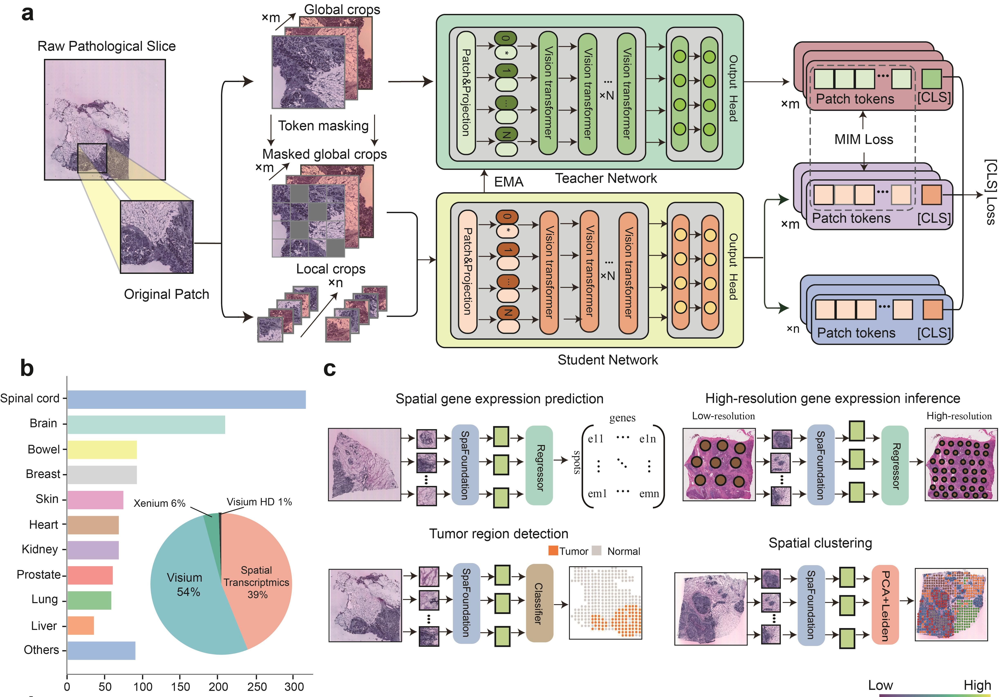

# SpaFoundation: A visual foundation model for spatial transcriptomics

## Requirements

- torch == 1.10.0+cu113  
- torchvision == 0.11.0+cu113  
- pip == 23.0  
- pytorch-lightning == 1.6.0  
- matplotlib == 3.6.3  
- scipy == 1.10.1  
- pandas == 1.4.3  
- scprep == 1.2.3  
- timm == 0.9.16  
- ipykernel == 6.29.3  

For environment management, we recommend [conda](https://docs.conda.io/en/latest/).

